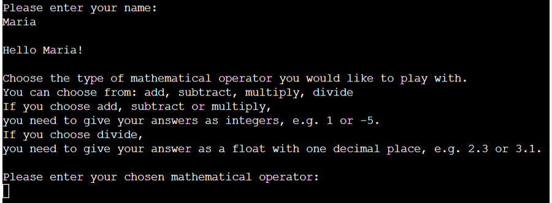
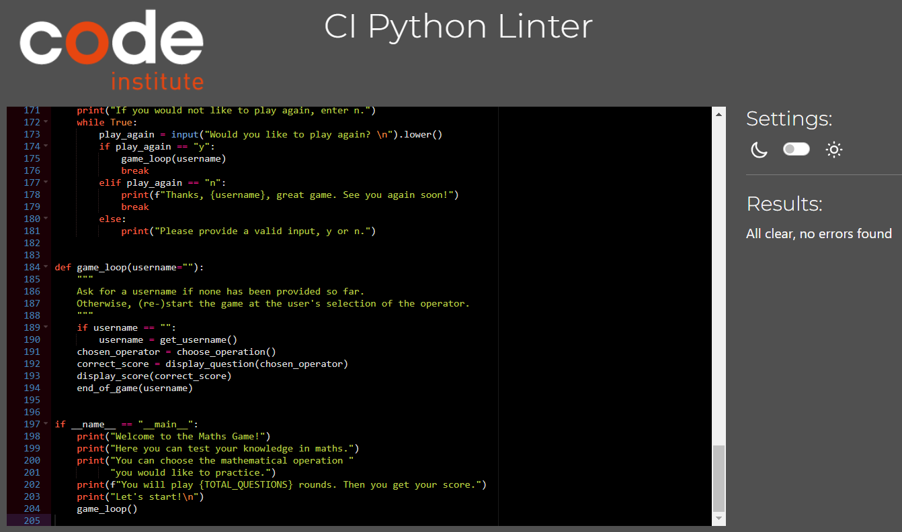

# Maths Game - A Game to Practice Maths Equations


This is a game to make practicing math equations easy. The game allows the user to choose the kind of mathematical operation they would like to play with. After a set number of questions, here 5, the user gets feedback and can choose to play again or exit the game.

Visit the site [here](https://maths-game-dff2c71c7ebb.herokuapp.com/).

## Table of Contents

1. [Design](#design)
2. [Features](#features)
3. [UX](#ux)
4. [Testing](#testing)
5. [Sources](#sources)
6. [Credits](#credits)

## Design

All texts are kept short and simple to make them easy to read for the user.
Line breaks are used frequently to help the user visually separate different instructions, topics and questions.
No background images or colors other than what was provided with the CI template were used.

### Flowchart

The flowchart was created using [Lucid](https://lucid.app/users/login#/login). It gives a visual overview of the logical steps followed while playing the game. 


## Features / Game Steps

The game follows a number of sequential steps.

- **Welcome Message**
    - Upon starting the game, a welcome message gets displayed.
    - It explains the goal of the game and how many rounds will be played.
    - Finally, it asks the user to enter their chosen name.

    

- **Username validation**
    - The name provided cannot be empty, or only white spaces
    - An error message is displayed should the user not provide a username
    - Note, the user is allowed to enter numbers or special characters, as the chosen username can be made up.

    

- **Choose operator**
    - After the user has provided a valid username, the user is greeted by name.
    - Next, the mathematical operators which can be chosen from get introduced. 
    - The user gets information on the format answers need to be provided in, depending on the operator chosen.

    

- **Operator validation**
    - The user may only select one of the four mathematical operators defined: add, subtract, multiply, divide.
    - Should the user enter a different input, or no input at all, an error message gets displayed, repeating the choices the user has.
    - Should the user choose to capitalize their otherwise correct input, such as "Add", the input gets accepted.

    

- **Displaying questions**
    - Upon selecting a valid operator input, the first question gets displayed to the user.
    - The user can input their answer below the question.
    
    

- **Validating answer**
    - The answer provided by the user gets validated.
    - Should the user enter no or an invalid input, an error message gets displayed, explaining which kind of input is valid.
    - The question gets repeated until a valid input is entered.

    - Note: Acceptable input for add, subtract and multiply questions is an integer. Acceptable input for divide questions is either a float or an integer, which will be rounded to 1 decimal place. This choice was made since it is more intuitive for a user to answer a question such as "5 / 5 = ?" with "1" rather than "1.0". Should the question be e.g. "10 / 9 = ?", then the answer "1" would be incorrect, since the integer "1" would be rounded to the float "1.0" which is incorrect. The correct answer would be "1.1".

    

- **Feedback to valid answer**
    - Upon entering a valid answer, the user immediately gets feedback on whether the provided answer was correct or incorrect.
    - While there are still questions to be answered, the next question gets displayed immediately.

    

- **Result**
    - After all questions have been answered, the user gets their score.
    - Together with the score, a percentage of correct answers is displayed.
    - The message to the user varies depending on their performance.

    

- **Play again? and validation**
    - At the end of the game, the user has the option to choose whether to play again.
    - If the user does not provide an input, or an invalid one, an error message gets displayed.
    - If the user selects to play again, the game starts again from the point where the user may choose an operator.

    

- **End of game**
    - If the user chooses to exit the game, a goodbye message is displayed to the user with their chosen username.

    

### Possible Future Features

- Choose difficulty level

    In the future, the game could be made more interesting by the user being able to choose a level of difficulty. Depending on the level of difficulty chosen, the range of the randomly generated numbers could either expand to include more numbers, or work exclusively with bigger numbers.

## UX

### Site Goals

The site wants to make it simple and easy for people to practice maths equations in a playful way. Instructions should be clear and feedback messages helpful.

### User Stories

**As a visitor:**

- I want to understand what the site is about when first visiting it.
- I want to understand the rules of the game.
- I want to choose which mathematical operator I play with.
- I want to receive meaningful feedback when I enter an invalid input.
- I want to know how I am doing in the game.
- I want to get a final score.
- I want to be able to choose to play again or exit the game.

**As the site administrator:**

- I want to be able to easily update parameters of the game, such as how many rounds the user has to play.
- I want to be able to add to or tweak the existing logic, such as implementing various difficulty levels.

## Testing

### Fixed Bugs

- When writing the code I was trying to pass a variable into a method unsuccessfully. The problem was that I did not define the relevant variable, which was the outcome of another method, in the global space but only within that previous method. Solved by assigning the outcome of the previous method to a variable in the global space. 
- When entering an invalid input as a username, ie no input at all or only whitespace, the validation worked the first time the user entered only whitespaces, but not the second time. Solved by adding .strip() to the input field which was displayed after the user had already once entered an invalid input.

### Unfixed Bugs

- None.

### Validator Testing

- PEP8 Python Linter: removed a number of whitespaces, and shortened line lengths to achieve a no error feedback message.
    - 

### Browser Testing (section adapted from Kay Welfare, results are my own)

Ensuring all validation and logic steps work as expected and meaningful feedback messages get displayed at every necessary step of the way. Browsers were tested in desktop versions.

| Browser     | Layout      | Functionality |
| :---------: | :----------:| :-----------: |
| Chrome      | ✔          | ✔             |
| Edge        | ✔          | ✔             |
| Firefox     | ✔          | ✔             |
| Safari*     | ✔          | ✔             |

*not available to me. Tested by my mentor, Spencer Barriball.

### Manual Testing of Logic and Input Validation (section adapted from Kay Welfare, results are my own)

| Feature     | Expect      | Action        | Result |
| :---------: | :----------:| :-----------: | :-----:|
| **Invalid Username Input**   | When entering no input or only whitespace, feedback message to be displayed   | Entered no username, then entered only whitespace | Feedback message displayed: "You did not enter anything. Please enter a valid name:" |
| **Valid Username Input**  | When entering a username, proceed to next step  | Entered a valid username | Next step was displayed, ie choosing a mathematical operator |
| **Invalid Mathematical Operator Choice** | When entering no or an invalid input, feedback message to be displayed  | Entered invalid input, such as no input, whitespace, numbers, or invalid words | Feedback message displayed: "'[ *Given input* ]' is not a valid input. Please choose one of the operators [ 'add', 'subtract', 'multiply', 'divide' ]:" |
| **Valid Mathematical Operator Choice** | When entering a valid mathematical operator, proceed to next step | Tried all four possible mathematical operators | Next step was displayed, ie the first question with the chosen mathematical operator |
| **Invalid Answer to Questions (Add, Subtract, Multiply)** | When entering no or an invalid input, feedback message to be displayed | Entered invalid input, such as no input, whitespace, letters, special characters or floats | Feedback message displayed: "Caught an error: [ *error message* ]. Please provide a number without any decimals, e.g. 3" |
| **Invalid Answer to Questions (Divide)** | When entering no or an invalid input, feedback message to be displayed | Entered invalid input, such as no input, whitespace, letters or special characters | Feedback message displayed: "Caught an error: [ *error message* ]. Please provide a float as an answer. Your answer will be rounded to 1 decimal place." |
| **Valid Answer to Questions (all)** | When entering a valid answer, feedback message and next question get displayed | Entered a valid input | Feedback message gets displayed. For correct input, "That is correct!", for incorrect input, "Oh no, that is incorrect...". Next question is displayed. |
| **All Questions Answered** | After answering all questions, score gets displayed and user gets asked whether they'd like to play again | Answered last question | Feedback message with absolute and relative score gets displayed, with a written statement based on the user's performance. User gets asked whether they would like to play again |
| **Play Again - Invalid Input** | When entering no or an invalid input, feedback message to be displayed | Entered invalid input, such as no input, whitespace, any letters other than "y" or "n", special characters or numbers | Feedback message gets displayed: "Please provide a valid input, y or n." |
| **Play Again - Yes** | If I would like to play again, be taken back to the choice of mathematical operator | Entered "y" when asked whether to play again | Game starts again with asking the user to enter a chosen mathematical operation |
| **Play Again - No** | If I would not like to play again, exit the game | Entered "n" when asked whether to play again | Feedback message displayed: "Thanks, [ username ], great game. See you again soon!" and game ends |

### Testing User Stories (section adapted from Kay Welfare, results are my own)

| Expectation                         | Result                          |
| :---------------------------------: | :------------------------------:|
| I want to confirm that Dr. Giri is a qualified psychotherapist | As a visitor, I can see that Dr. Giri is a psychotherapist on the home page, his full title is visible on the contact page |
| I want to know which languages Dr. Giri speaks | As a visitor, I can find the languages which Dr. Giri offers sessions in on the about page |
| I want to learn about the types of sessions Dr. Giri offers | As a visitor, I can find the types of sessions which Dr. Giri offers on the about page |
| I want to know how much a session costs | As a visitor, I can find the costs of the various types of sessions on the about page |
| I want to find out whether Dr. Giri specializes in the field which I struggle with | As a visitor, I can find the fields Dr. Giri specializes in on the about page |
| I want to see where Dr. Giri is located | As a visitor, I can find Dr. Giri's practice's address on the contact page |
| I want to be able to get in contact with Dr. Giri in the manner that I choose to. | As a visitor, I can choose to get in contact with Dr. Giri in the manner I prefer, whether this is to send an email, or call, or have Dr. Giri contact me |
| I want to see a mobile friendly layout and responsive design | As a visitor, I have a good view of the site on mobile device without overflow or side-scrolling |

## Deployment

This site was deployed on GitHub Pages:
- From the repository, first navigate to "Settings" (top of the page) and then "Pages" (left of the newly opened page)
- Under "Source" choose "Deploy from a Branch" in the dropdown menu
- Choose the "main" Branch, and folder "/(root)"
- Click "save"
- The website is subsequently deployed (this may take a few minutes) on GitHub Pages
- To get there, in the "Code" tab of the repository, on the right-hand side under "Environments" click on "github-pages"
- On the newly opened page, on the right-hand side, click on "View deployment"

## Sources

- Love Running walk-through project for basic structures of header and footer
- Favicon was generated using [favicon.cc](https://www.favicon.cc/)
- The mock-up image of the site on different devices was generated using [techsini.com](https://techsini.com/multi-mockup/)
- All images taken from pexels.com, except the headshot of Dr. Himanshu Giri, which is from author's private photos
- Images were compressed using [iloveimg.com](https://www.iloveimg.com/)
- Icons were taken from [fontawesome.com](https://fontawesome.com/)

## Credits
- Holly from Tutor Support for spotting a space in the import of my Google Fonts which caused problems with my styling
- https://css-tricks.com/dont-overthink-flexbox-grids/ for helping me figure out how to get the flexbox on my about page to produce same-width children
- https://www.w3schools.com/cssref/pr_list-style-position.php for helping me get the bullet points of my list inside the flex container
- Our group facilitator, Kay Welfare, for her patience and genuine efforts to help. And for not getting tired to repeat certain points over and over again
- Again, Kay Welfare, for sharing her readme with us
- https://www.w3schools.com/howto/tryit.asp?filename=tryhow_css_two_columns_flex for teaching me how to make two columns for the form
- https://sentry.io/answers/how-do-i-create-an-html-button-that-acts-like-a-link/ for helping me fix the error which came up in W3C testing that an ```a``` -element may not be the descendant of a ```button``` -element
- My mentor, Adegbenga Adeye, for his input
- My partner, Himanshu Giri, for providing me with the text input for this project


## Credits
- On how to use the round() function: https://www.geeksforgeeks.org/round-function-python/